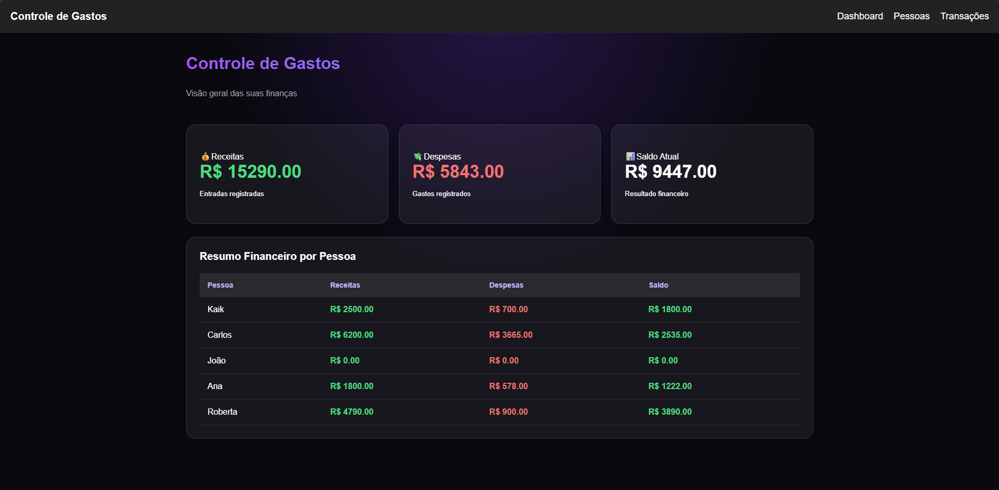
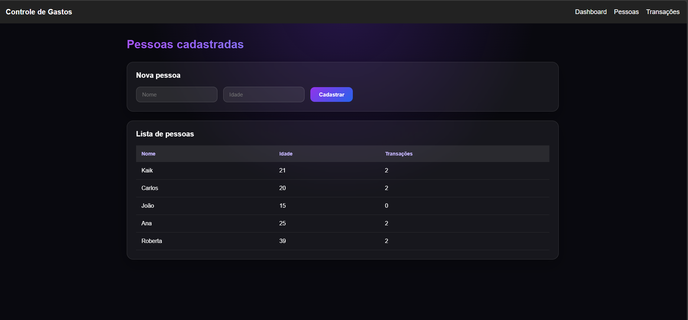
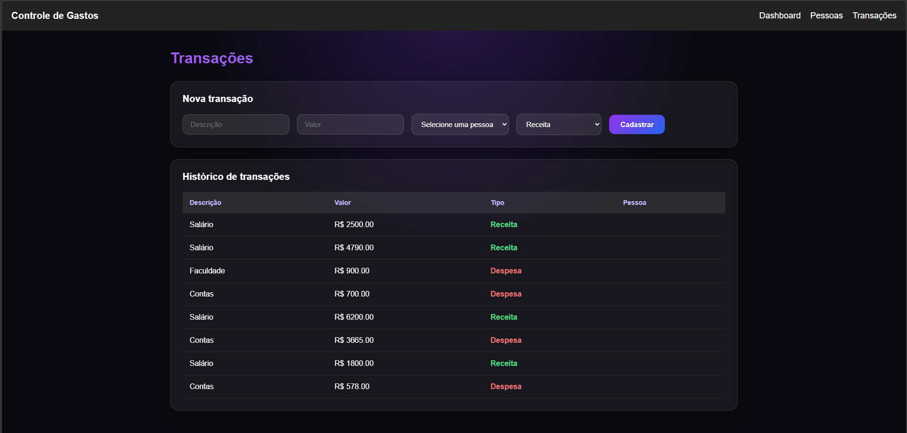

# 💰 Controle de Gastos Residenciais

Sistema desenvolvido para auxiliar no controle financeiro residencial, permitindo o gerenciamento de pessoas, receitas, despesas e transações de forma simples e organizada.

O projeto foi criado com foco em boas práticas de desenvolvimento de software, separação de responsabilidades e construção de uma aplicação completa utilizando uma API em .NET e uma interface moderna em React + TypeScript.

---

## 📌 Sobre o Projeto

O **Controle de Gastos Residenciais** permite que usuários acompanhem sua vida financeira através do cadastro de pessoas, registro de movimentações financeiras e visualização de informações consolidadas através de um dashboard.

O objetivo principal é facilitar o acompanhamento de:

- Receitas;
- Despesas;
- Saldo financeiro;
- Pessoas cadastradas;
- Histórico de transações.

---

# 🚀 Tecnologias Utilizadas

## Backend

- C#
- ASP.NET Core Web API
- Entity Framework Core
- SQL Server
- Swagger para documentação da API

## Frontend

- React
- TypeScript
- Vite
- CSS3
- Consumo de API REST

## Ferramentas

- Git
- GitHub
- Visual Studio Code
- Visual Studio

---

# ✨ Funcionalidades

## 📊 Dashboard Financeiro

Visualização geral da situação financeira:

- Total de receitas;
- Total de despesas;
- Saldo atual;
- Resumo das movimentações.

---

## 👥 Gerenciamento de Pessoas

Permite cadastrar e visualizar pessoas relacionadas ao controle financeiro.

Funcionalidades:

- Cadastro de pessoas;
- Listagem de usuários;
- Organização dos responsáveis pelas movimentações.

---

## 💳 Controle de Transações

Gerenciamento das movimentações financeiras:

- Registro de receitas;
- Registro de despesas;
- Controle de valores;
- Organização financeira.

---

# 🏗️ Estrutura do Projeto
